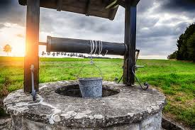

TANZANIA WATER WELL PROJECT

 
PROJECT OVERVIEW

Water bodies are not just beautiful; they are essential for our survival. Water is vital for household use, economic activities like producing electricity, and maintaining health and hygiene.
Recent data from the World Bank show that Tanzania has about 60 million people. Many Tanzanians still face challenges in getting clean and safe water (Nsemwa, 2022). Only 30.6% of Tanzanian households use recommended methods to treat water, and just 22.8% have proper hand-washing facilities (Ministry of Health, 2019). Poor sanitation leads to around 432,000 deaths from diarrhea each year and contributes to several neglected tropical diseases like intestinal worms, schistosomiasis, and trachoma. It also worsens malnutrition (WHO, 2019).

PROBLEM STATEMENT

Our NGO, Danida, is focused on finding and replacing water wells that need repair. Our classification model is being used to better predict which wells in the area are operational, need repairs or are non-functional using various information such as when each well was installed, who funded the project, and population around each well. Any improvement in determining the best wells to install or in the predictability of which wells need repairs could have an enormous impact on the people of Tanzania.

OBJECTIVES

Main Objective

The primary goal of this study is to develop a predictive model that can classify the functional status of water wells in Tanzania. This model will provide valuable insights to the ministry by identifying both functional and non-functional water points, offering essential information for future well planning, and pinpointing regions vulnerable to water scarcity.

Specific objective

Enhance maintenance operations by targeting inspections on water points with a high probability of needing repair or already failed.

Achieve 70%-75% accuracy in predicting well functionality.

Evaluate the functionality status concerning payment type.

BUSINESS UNDERSTANDING

The data is sourced from Taarifa and the Tanzanian Ministry of Water. Data utilized can be found here: https://www.drivendata.org/competitions/7/pump-it-up-data-mining-the-water-table/data/

For the purposes of our evaluation, we are utilizing the Training Set Labels and Training Set Values, which include data from 59,400 pumps. Our cleaned data contains information from 59,028 pumps.

The target variable is status_group with the labels:

functional - the waterpoint is operational and there are no repairs needed
functional needs repair - the waterpoint is operational, but needs repairs
non functional - the waterpoint is not operational

