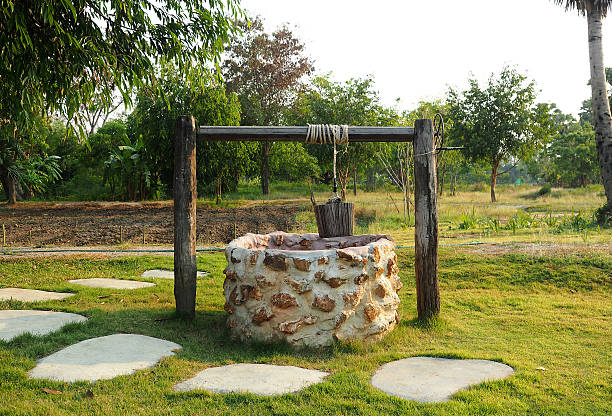
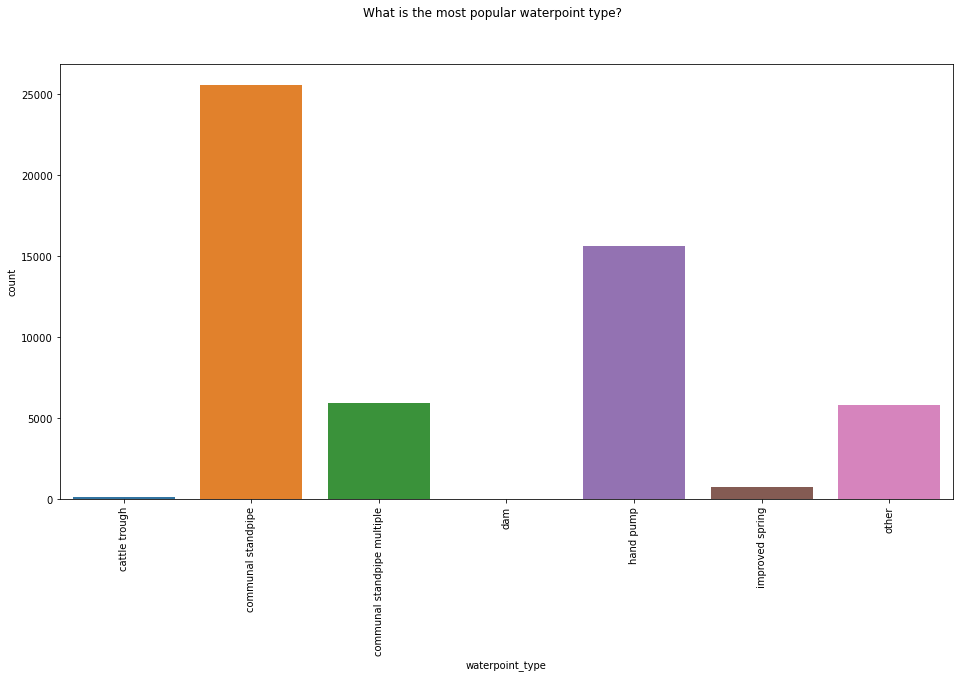
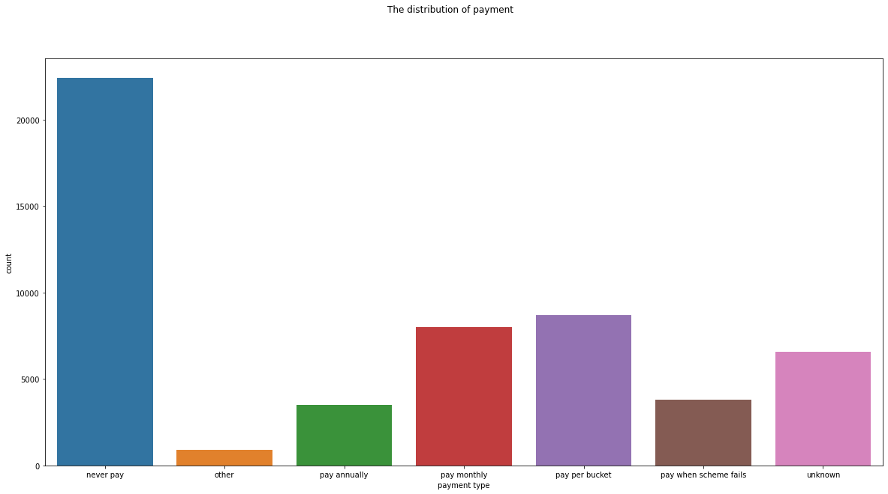

***TANZANIA WATER WELL PROJECT***

 
***PROJECT OVERVIEW***

Water bodies are not just beautiful; they are essential for our survival. Water is vital for household use, economic activities like producing electricity, and maintaining health and hygiene.
Recent data from the World Bank show that Tanzania has about 60 million people. Many Tanzanians still face challenges in getting clean and safe water (Nsemwa, 2022). Only 30.6% of Tanzanian households use recommended methods to treat water, and just 22.8% have proper hand-washing facilities (Ministry of Health, 2019). Poor sanitation leads to around 432,000 deaths from diarrhea each year and contributes to several neglected tropical diseases like intestinal worms, schistosomiasis, and trachoma. It also worsens malnutrition (WHO, 2019).

***PROBLEM STATEMENT***

Our NGO, Danida, is focused on finding and replacing water wells that need repair. Our classification model is being used to better predict which wells in the area are operational, need repairs or are non-functional using various information such as when each well was installed, who funded the project, and population around each well. Any improvement in determining the best wells to install or in the predictability of which wells need repairs could have an enormous impact on the people of Tanzania.

***OBJECTIVES***

Main Objective

The primary goal of this study is to develop a predictive model that can classify the functional status of water wells in Tanzania. This model will provide valuable insights to the ministry by identifying both functional and non-functional water points, offering essential information for future well planning, and pinpointing regions vulnerable to water scarcity.

Specific objective

Enhance maintenance operations by targeting inspections on water points with a high probability of needing repair or already failed.

Achieve 70%-75% accuracy in predicting well functionality.

Evaluate the functionality status concerning payment type.

***BUSINESS UNDERSTANDING***

The data is sourced from Taarifa and the Tanzanian Ministry of Water. Data utilized can be found here: https://www.drivendata.org/competitions/7/pump-it-up-data-mining-the-water-table/data/

For the purposes of our evaluation, we are utilizing the Training Set Labels and Training Set Values, which include data from 59,400 pumps. Our cleaned data contains information from 59,028 pumps.

The target variable is status_group with the labels:

functional - the waterpoint is operational and there are no repairs needed
functional needs repair - the waterpoint is operational, but needs repairs
non functional - the waterpoint is not operational

***DATA PREPARATION***

During this phase of the analysis, the focus will be on addressing missing values, identifying and removing duplicated entries, resolving inconsistencies, and handling invalid data. Initially, we excluded irrelevant columns identified during the data understanding phase, as there is no need to prepare columns that will not be utilized in the analysis.

*** Exploratory Data Analysis**

In this phase of the investigation, the study will look at the trends, patterns using visualizations and statistics to show the relationships between the variables within the data
we used the univariate and bivariate analysis on the data

we found out that the most featured waterpoint type is communal standpipe followed by handpump. The least featured is dam.

Wells that are not payed for feature the most in this data, followed by pay per bucket, unknown and pay monthly.

The least occuring are pay annually, pay when scheme fails and other.

***Modelling***

To prepare our data to machine learning, we did some feature engineering, encoding.
The following models were used:
Decision trees
Random forest
XG boost

I settled on the XG boost as it was giving me a higher accuracy.

***RECOMMENDATIONS***
Investments should be directed towards communal standpipes, rather than communal standpipe multiples, as the majority of the latter are non-functional.

Priority should be given to non-functional wells and functional wells that need repair, provided they have sufficient water.

Providing payment creates an incentive and means to maintain wells in a functional state.

The central regions of the country may have fewer wells, likely due to lower population density. However, it's crucial for the government to ensure adequate water supply for the residents in those areas.

***NEXT STEPS***
Monitor the wells and update the model regularly to continuously improve our startegy

Better data trained in our model will improve the predictions

Learn cost of repairs, construction, and preventive maintenance

Create a cost-benefit function to prioritize actions

